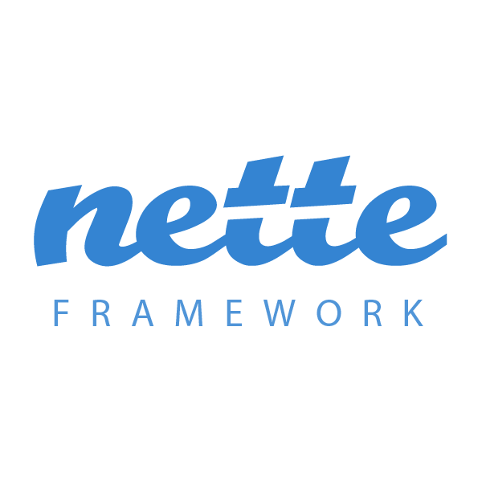
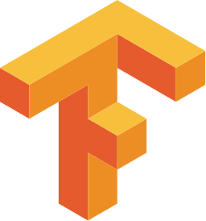
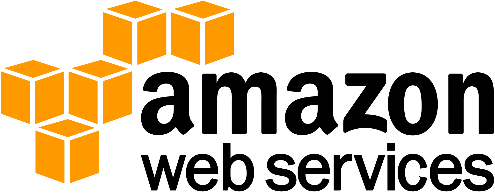

## Glad to see you here! &nbsp; 

I'm a student Bachelor's in software engineering 🎓 from Tomas Bata University 🏛. I'm a passionate learner who's always
willing to learn and work across technologies💡. I love to explore new technologies and leverage them to solve real-life
problems ✨. Apart from that, I also love to guide and mentor newbies 👨🏻‍💻. I'm currently into Web Development, 🕸️
and I'm working on my projects that help others 🤓.

📣 They are currently working on their bachelor thesis on **Forensic Tool for Detecting Child Pornography Using Deep Neural Networks**. In this thesis, I comprehensively deal with data collection, data analysis, dataset processing, development and tuning of artificial neural model based on convolutional neural network and final deployment into software.

### 🙌🏻 Talking about Personal Stuffs:

- 🛠 &nbsp; I’m currently working with PHP, Nette Framework, Python, TensorFlow, Keras
- 👨🏻‍💻 &nbsp; Most of my projects are available on [GitHub](https://github.com/filipsedivy).
- 🧠 &nbsp; I'm interested in artificial intelligence and I like to study it
- 💻 &nbsp; I love exploring new tech stack and building cool stuffs.

### 😍 Favorite Programming Languages

<table>
 <tr>
  <td align="center" width="96">
      
       PHP
   </td>
   <td align="center" width="96">
      
       Python
   </td>
   <td align="center" width="96">
      
       Java
   </td>
 </tr>
</table>

### 🚀 Favorite Tech

<table>
  <tr>
    <td align="center" width="96">
      
       Nette
    </td>
    <td align="center"  width="96">
      
       TensorFlow
    </td>
    <td align="center"  width="96">
      
       Keras
    </td>
    <td align="center" width="96">
      
       AWS
    </td>
    <td align="center" width="96">
      
       Docker
    </td>
  </tr>
</table>

### 🧑‍🚀 Open Source Projects

<table>
  <thead align="center">
    <tr>
      <td><b>💻 Projects</b></td>
      <td><b>🌟 Stars</b></td>
      <td><b>🍴 Forks</b></td>
      <td><b>🐛 Issues</b></td>
      <td><b>🔔 Pull Requests</b></td>
      <td><b>👨‍💻 Language</b></td>
    </tr>
  </thead>
  <tbody>
    <tr>
    	<td><a href="https://github.com/filipsedivy/pixel.py"><b>🖼 Pixel.py</b></a></td>
      <td></td>
      <td></td>
      <td></td>
      <td></td>
      <td></td>
    </tr>
    <tr>
      <td><a href="https://github.com/filipsedivy/SortNinja"><b>🥷 SortNinja</b></a></td>
      <td></td>
      <td></td>
      <td></td>
      <td></td>
      <td></td>
    </tr>
    <tr>
    	<td><a href="https://github.com/filipsedivy/php-eet"><b>💸 Electronic records of sale</b></a></td>
      <td></td>
      <td></td>
      <td></td>
      <td></td>
      <td></td>
    </tr>
    <tr>
    	<td><a href="https://github.com/filipsedivy/cnb-api"><b>⚡️ CNB exchange rates</b></a></td>
      <td></td>
      <td></td>
      <td></td>
      <td></td>
      <td></td>
    </tr>
  </tbody>
</table>

### 🔐 Security Projects

<table>
  <thead align="center">
    <tr>
      <td><b>💻 Projects</b></td>
    </tr>
  </thead>
  <tbody>
    <tr>
      <td><a href="https://github.com/filipsedivy/CVE-2020-15227"><b>CVE-2020-15227</b></a></td>
    </tr>
  </tbody>
</table>

### 📊 Github Stats

